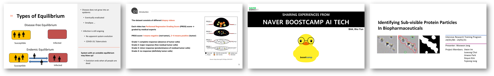

# RC4, Intensive Research Training Program (IRTP) Seminar Series

Organized by Ho-min Park (Ph.D. Student, Ghent University)

During the winter of 2023-2024, the Center for Biosystems and Biotech Data Science (RC4) at Ghent University Global Campus successfully conducted four winter training programs. These initiatives were specifically designed for undergraduate students, with the primary goal of deepening their understanding of their respective fields and equipping them with the necessary skills to apply this knowledge in practical research settings. The programs, which commenced in January 2024 and concluded in February, covered a broad range of topics, encouraging participants to engage in comprehensive self-study and tackle problem-solving exercises relevant to their subjects of interest.

Recognizing the importance of documenting and sharing research outcomes, RC4 facilitated a platform for participants to present their findings. This took the form of a 15-minute PowerPoint presentation, followed by a 5-minute question-and-answer session, allowing students to discuss their work and the insights they gained throughout the program. These presentations were held across two days, February 26th and 27th, between 6:20 PM and 8:20 PM, providing an invaluable opportunity for knowledge exchange and feedback.

Below, you can find detailed information regarding the programs' supervisors, advisors, titles, and access to the PowerPoint presentations and related materials submitted by the students, showcasing the diverse range of projects undertaken during these winter training programs.

## IRTP Winter Seminars

The IRTP seminars are part of our commitment to nurturing the skills and knowledge of our students in the field of AI and related research areas. Below are the program highlights and the seminar presentations planned for this winter.

The following table presents the list of IRTP supervisors and advisors for this winter's seminars:

| Supervisor            | Advisor               | Program Title                                                     |
|-----------------------|-----------------------|-------------------------------------------------------------------|
| Prof. Shodhan Rao     | Mr. Sharmant Basidoni | Stability analysis of infection models                           |
| Prof. Wesley De Neve  | Dr. Utku Ozbulak      | Identifying Subvisible Protein Particles in Biopharmaceuticals   |
| Prof. Wesley De Neve  | Mr. Espoir Kabanga    | Using Deep Learning in Genomics: A Data-Driven Perspective       |
| Prof. Wesley De Neve  | Mr. Ho-min Park       | [AI Winter School - Tutorial training for BSc. level students](https://github.com/powersimmani/AIWS2024) |

## Seminar Presentations

### February 26th, Monday Session

The presentations on February 26th included three students from  the AIWS Beginner group and two students from Using Deep Learning in Genomics.

| Presenter                  | Title                                                                   | Code | PPT Link |
|----------------------------|-------------------------------------------------------------------------|------|----------|
| Chae-Eon Rhee              | Analysis with ML models - Hepatitis C Prediction dataset                | Link | Link     |
| Gaeun Oh                   | Analysis with ML models - Panic Disorder Detection Dataset              | Link | Link     |
| Selin Yang                 | Analysis with ML models - Gene expression dataset                       | Link | Link     |
| Younghyun Cha              | Using Deep Learning in Genomics: A Data-Driven Perspective              | Link | Link     |
| Hyochan Heo                | Using Deep Learning in Genomics: A Data-Driven Perspective              | Link | Link     |

### February 27th, Tuesday Session

The presentations on February 27th featured contributions from three AIWS Advanced group students, two students focused on the stability analysis of infection models, and one student working on identifying subvisible protein particles in biopharmaceuticals. Additionally, as a special guest, Ilho Yun, an active participant in the Naver Connect AI Bootcamp program, was invited to share his experiences.

| Presenter                  | Title                                                                   | Code | PPT Link |
|----------------------------|-------------------------------------------------------------------------|------|----------|
| Dongin Moon                | Preliminary study of PIPAC Biopsy dataset                               | Link | Link     |
| Dahee Kim                  | Unsupervised learning on Single cell genome analysis - downstream analysis | Link | Link     |
| Taekeun Kim & Wonjun Yang  | Equilibrium stability of infection models                               | Link | Link     |
| Iho Yun                    | Sharing Experience from Naver Connect AI Boost Camp                     | Link | Link     |
| Woowon Jang                | AI-powered segmentation of sub-visible protein particles in biopharmaceuticals | Link | Link     |

